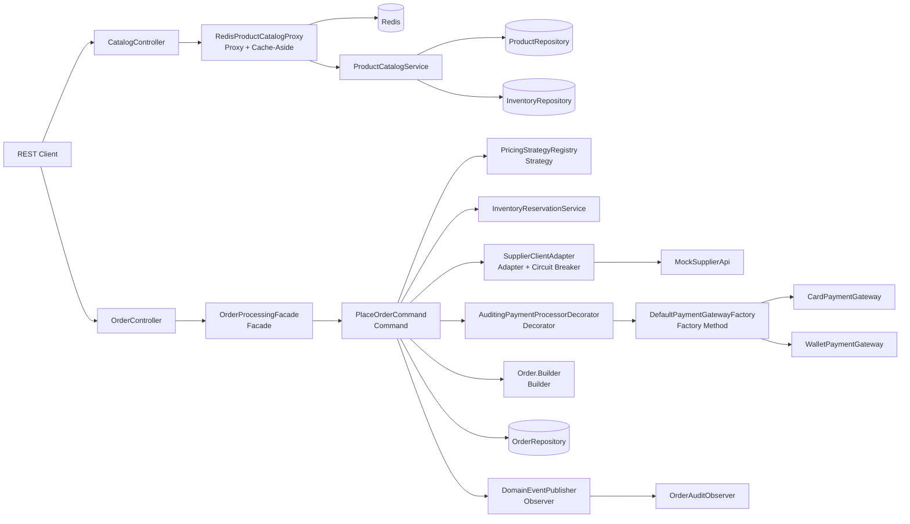

# Architecture Diagram

```mermaid
flowchart LR
    Client["REST Client"] --> CatalogController["CatalogController"]
    Client --> OrderController["OrderController"]

    CatalogController --> CacheProxy["RedisProductCatalogProxy\nProxy + Cache-Aside"]
    CacheProxy --> Redis[("Redis")]
    CacheProxy --> CatalogService["ProductCatalogService"]
    CatalogService --> ProductRepo[("ProductRepository")]
    CatalogService --> InventoryRepo[("InventoryRepository")]

    OrderController --> Facade["OrderProcessingFacade\nFacade"]
    Facade --> Command["PlaceOrderCommand\nCommand"]
    Command --> Pricing["PricingStrategyRegistry\nStrategy"]
    Command --> Inventory["InventoryReservationService"]
    Command --> Supplier["SupplierClientAdapter\nAdapter + Circuit Breaker"]
    Supplier --> MockSupplier["MockSupplierApi"]
    Command --> Payment["AuditingPaymentProcessorDecorator\nDecorator"]
    Payment --> Factory["DefaultPaymentGatewayFactory\nFactory Method"]
    Factory --> Card["CardPaymentGateway"]
    Factory --> Wallet["WalletPaymentGateway"]
    Command --> OrderBuilder["Order.Builder\nBuilder"]
    Command --> OrderRepo[("OrderRepository")]
    Command --> Events["DomainEventPublisher\nObserver"]
    Events --> AuditObserver["OrderAuditObserver"]
```
